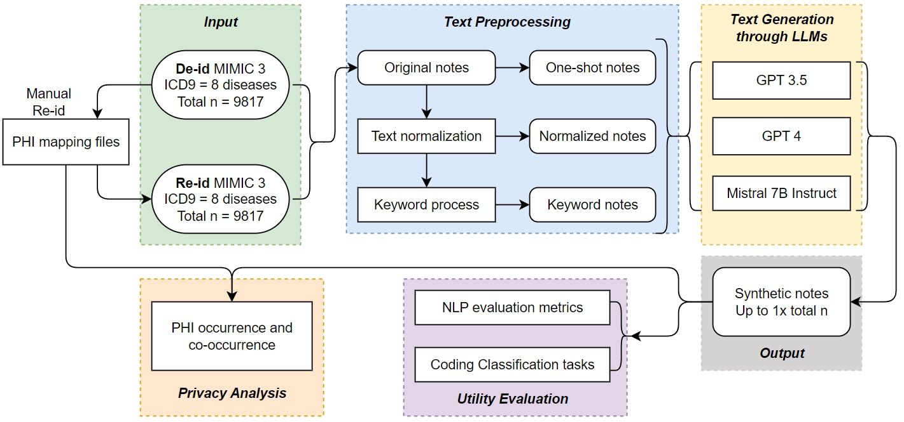

# Robust Privacy Amidst Innovation with Large Language Models Through a Critical Assessment of the Risks

  
  

## Description

In this work, we presents a novel method that enhances data privacy and interoperability in biomedical research by using advanced large language models (LLMs) to generate private, high-quality synthetic notes.

- Facilitates global collaboration with anonymized synthetic notes while maintaining patient data usability.
- Enhances trust, transparency, and security in patient data usage, encouraging participation in clinical research.
- Sets new ethical standards for AI in healthcare, representing a paradigm shift in patient privacy protection.

## Table of Contents

- [Installation](#installation)
- [Usage](#usage)
- [Contributing](#contributing)

## Installation

#### 1. Data preparation
* The data used is from the MIMIC-III Clinical Database and is available under PhysioNet. Access to the data can be requested from PhysioNet. 
* The data preprocessing steps can be found at [GenerateEHRs](#https://github.com/mominbuet/GenerateEHRs).
* ***Caution***: The GPT models' API utilized in this work is the HIPAA-compliant Azure OpenAI platform provided by UTHealth to ensure compliance with the data usage agreement requirements of MIMIC-III. More details could be found on the [PhysioNet annoucement](#https://physionet.org/news/post/gpt-responsible-use).

#### 2. Python package
- Keyword extraction: 
`pip install requirements_keyword_extraction.txt`
- 

## Usage

1. Data Preparation

## Contributing

Guidelines on how to contribute to the project.

## License

Information about the project's license.
